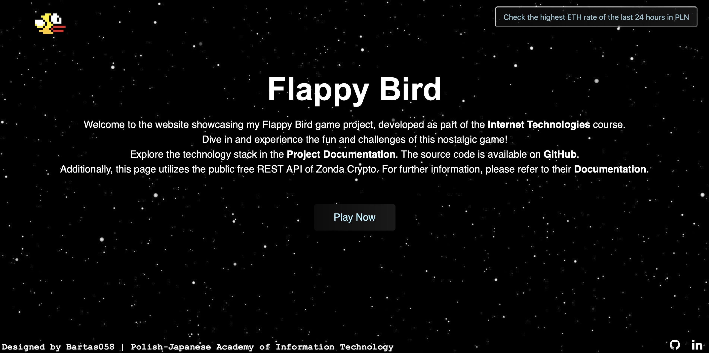
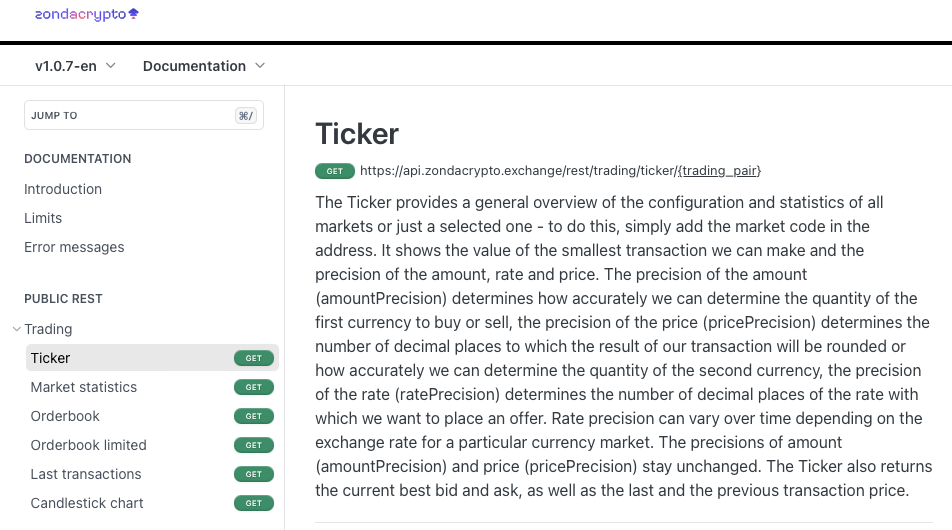

## README.md


## About the Project

Welcome to the Flappy Bird game project, developed as part of the Internet Technologies course at Polish-Japanese Academy of Internet Technology. Experience the nostalgia and challenge of Flappy Bird with a modern touch!

## Important Notice for Windows Users

I've received reports of accelerated game speed on Windows. This issue may be influenced by browser settings, cookies, blockers, or memory constraints. Please be assured that the JavaScript code is consistent for all users, and the web code is open for investigation.

As a solution, Windows users experiencing excessive speed can try clearing browser history and cookies. Alternatively, we recommend running the game on iOS devices, particularly Mac, for a more stable experience.

I apologize for any inconvenience and appreciate your understanding.

## Table of Contents

- [Background](#background)
- [How to Play](#how-to-play)
- [Game](#local-setup)
- [Endpoints](#endpoints)
- [Technologies](#technologies)
- [Zonda Crypto API Integration](#zonda-crypto-api-integration)
- [License](#license)
- [References](#references)
- [Author](#author)

## Background

The game features a visually appealing background that can be customized. Players can choose from different cityscape backgrounds, including Tokyo, Seoul, and Los Angeles (inspired by Fast and Furious).

## How to Play

- **Start the Game:** Press the spacebar to make the bird jump and start the game.
- **Navigate:** Guide the bird through the pipes by tapping the jump key.
- **Score Points:** Successfully passing through pipes scores points.
- **Game Over:** The game ends if the bird collides with the pipes or falls off the screen.

## Endpoints

1. README.md

   ```html
   https://bartas058.github.io/FlappyBird/
   ```

2. Landing Page

   ```html
   https://bartas058.github.io/FlappyBird/Home/
   ```

   

3. Flappy Bird

   ```html
   https://bartas058.github.io/FlappyBird/App/
   ```

   

## Game

To play the game on your website, follow these simple steps:

1. Visit [Flappy Bird Game](https://bartas058.github.io/FlappyBird/App/).

   ```html
   https://bartas058.github.io/FlappyBird/App/
   ```

2. Enjoy the game!

## Technologies

* HTML
* CSS
* JavaScript
* jQuery CDN (Content Delivery Network) - 3.7.1
* Ajax
* Zonda Crypto API
* GitHub Pages

## Zonda Crypto API Integration

To display the highest ETH to PLN exchange rate in the last 24 hours, we use the public and free Zonda Crypto API.



## License

This project is licensed under the MIT License - see the LICENSE file for details.

Feel free to explore, customize, and share this Flappy Bird game! Have fun!

## References

* [jQuery CDN Documentation](https://releases.jquery.com)
* [Ajax Documentation](https://api.jquery.com/category/ajax/)
* [Zonda Crypto API Documentation](https://docs.zondacrypto.exchange/reference/introduction)
* [GitHub Pages](https://pages.github.com)

## Author

Kacper Prusak (Bartas058) - Polish-Japanese Academy of Information Technology